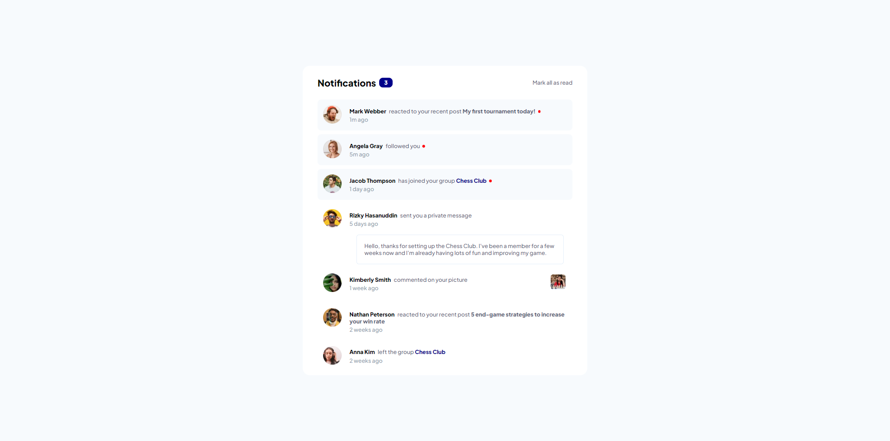

# Frontend Mentor - Notifications page solution

This is a solution to the [Notifications page challenge on Frontend Mentor](https://www.frontendmentor.io/challenges/notifications-page-DqK5QAmKbC). Frontend Mentor challenges help you improve your coding skills by building realistic projects. 

## Overview

### The challenge

Users should be able to:

- Distinguish between "unread" and "read" notifications
- Select "Mark all as read" to toggle the visual state of the unread notifications and set the number of unread messages to zero
- View the optimal layout for the interface depending on their device's screen size
- See hover and focus states for all interactive elements on the page

### Screenshot

### Links

- Solution URL: https://tomaszbar4.github.io/Notifications-Page-Main/

## My process

### Built with

- Semantic HTML5 markup
- CSS custom properties
- Flexbox
- Vanilla Javascript

**Note: These are just examples. Delete this note and replace the list above with your own choices**

### What I learned

That is the first project I have put some javascript that I've learned to use. When it comes to html and css I made good use of flexbox to adjust the position of all the content. It's also first project that I'm publishing on my GitHub so I'm very proud of it.

### Continued development

I definitely need to learn more JavaScript to be able to write code more efficiently and I need to clone some of the existing webpages to become even better at styling in CSS.

## Author

- Website - Tomasz Bartnikiewicz
- Frontend Mentor - [@tomaszbar4](https://www.frontendmentor.io/profile/tomaszbar4)
